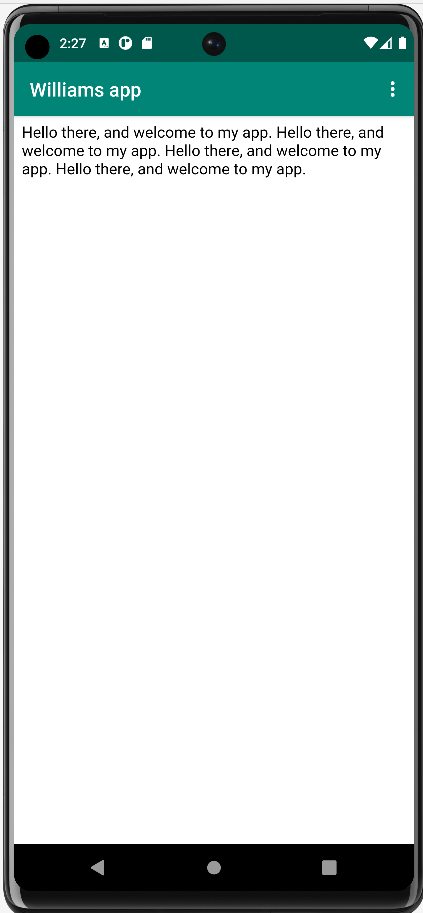
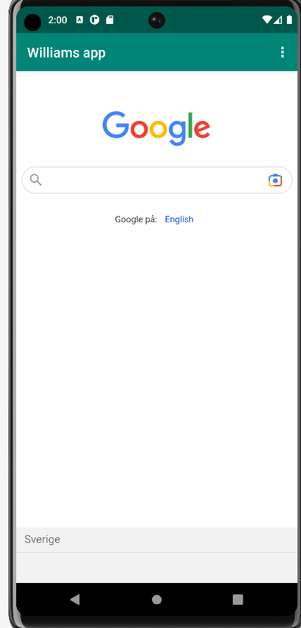

# Rapport

Jag började med att forka projektet. Sedan Följde jag instruktionerna och bytte namn
på projektet genom att ändra i AndroidManifest.xml. För att aktivera internetuppkoppling
i min app lade jag till raden <uses-permission android:name="android.permission.INTERNET" />
i AndroidManifest.xml. Sedan skapade jag en webview genom det grafiska gränssnittet i layout
filen genom att först radera textViewn, och sedan dra in en webview. Därefter Skapade jag en privat
variabel som innehåller webview för att kunna komma åt den från alla funktioner i MainActivity.
Sedan aktiverades javascript support. Därefter länkades de olika sidorna; HTML filen jag själv skapat samt 
en länk till google, så att de öppnas beroende på vilken knapp användaren tryckt på. Till sist Fixades ett
problem som uppstod där Webview inte "gick" hela vägen ner till nedre kanten genom att sätta höjden på webview till
match_parent.

Nedan syns bilder på hur de båda sidorna ser ut.

